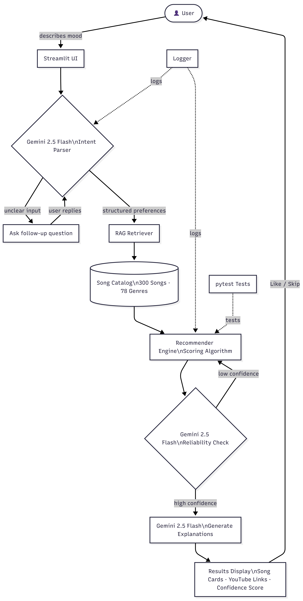

# VibeCheck — AI-Powered Music Recommender

## Title and Summary

**VibeCheck** is an AI-powered music recommender. Describe how you want to feel — *"something dark and cinematic for a late night drive"* — and it figures out the rest.

A Gemini-powered agent interprets your request, scores a curated catalog of 300 tracks, and evaluates the results before surfacing them. Every recommendation includes a plain-language explanation and a direct YouTube link.

VibeCheck integrates three AI features in one app — Retrieval-Augmented Generation, an Agentic Workflow, and a Reliability/Testing System — making it usable by anyone without technical knowledge.

---

## Original Project — Modules 1–3

This builds on **VibeCheck 1.0**, a rule-based CLI recommender from Modules 1–3. That version had no AI, required numeric inputs, and ran on 24 hardcoded songs. It showed where content-based filtering succeeds and where it breaks down.

This version keeps the scoring foundation and adds a Gemini AI layer, a Streamlit chat interface, a 300-song catalog across 78 genres, and three integrated AI features that address every gap the original exposed.

---

## System Architecture



Six components run in sequence:

1. **Streamlit UI** — chat interface; returns song cards with explanations and YouTube links.
2. **Gemini Agent** — parses natural language into structured preferences; asks one clarifying question if the request is ambiguous.
3. **RAG Retriever** — retrieves catalog candidates before generation (retrieve first, then generate).
4. **Recommender Engine** — scores songs on genre, mood, energy, and lyrical fields using weighted rules.
5. **Gemini Evaluator** — checks confidence, flags weak matches, detects contradictions, and verifies playlist cohesion before results are shown.
6. **Logger** — writes every request, API call, score, and error to a structured log file.

Users interact at two points: the initial request and the feedback loop (Like/Skip, which the agent uses to adjust).

---

## Setup Instructions

### Requirements

- Python 3.10 or higher
- A Google AI API key


### Step-by-Step Setup

**1. Clone the repository**
```bash
git clone https://github.com/Christian101GTZ/Applied_AI_Final_Project-.git
cd Applied_AI_Final_Project-
```

**2. Create and activate a virtual environment**
```bash
python -m venv .venv

# Mac or Linux
source .venv/bin/activate

# Windows
.venv\Scripts\activate
```

**3. Install dependencies**
```bash
pip install -r requirements.txt
```

**4. Set up your API key**

Create a file named `.env` in the project root with the following content:
```
GOOGLE_API_KEY=your-api-key-here
```

This file is listed in `.gitignore` and will never be pushed to GitHub.

**5. Run the application**
```bash
streamlit run app.py
```

Your browser will open automatically at `http://localhost:8501`.

**6. Run the test suite**
```bash
pytest
```

---

## Sample Interactions

Raw scoring output is shown below. In the full app, Gemini replaces these rule strings with natural language explanations.

---

**Example 1 — Strong match: High-Energy Pop**

User profile: genre = pop, mood = happy, energy = 0.92

```
#1  Happy -- Pharrell Williams
    Genre: pop | Mood: happy | Energy: 0.82
    Score: 4.50
    Why: genre match (+2.0); mood match (+1.5); energy close match: 0.82 ~= 0.92 (+1.0)

#2  Watermelon Sugar -- Harry Styles
    Genre: pop | Mood: happy | Energy: 0.80
    Score: 4.00
    Why: genre match (+2.0); mood match (+1.5); energy partial match: 0.80 near 0.92 (+0.5)

#3  Blinding Lights -- The Weeknd
    Genre: pop | Mood: fun | Energy: 0.90
    Score: 3.75
    Why: genre match (+2.0); similar mood: fun is in the same family as happy (+0.75); energy close match: 0.90 ~= 0.92 (+1.0)
```

Happy ranked first (all three dimensions matched). Watermelon Sugar second (weaker energy match). Blinding Lights third — closer in energy but only a partial mood match.

---

**Example 2 — Edge case: Contradicting preferences**

User profile: genre = lofi, mood = chill, energy = 0.90

```
#1  Aruarian Dance -- Nujabes
    Genre: lofi | Mood: chill | Energy: 0.38
    Score: 3.50
    Why: genre match (+2.0); mood match (+1.5); no energy points — too far from 0.90

#2  South of the River -- Tom Misch ft. Loyle Carner
    Genre: lofi | Mood: chill | Energy: 0.35
    Score: 3.50
    Why: genre match (+2.0); mood match (+1.5); no energy points — too far from 0.90
```

Genre and mood outweigh energy in the point totals, so the rule engine returns quiet lofi regardless. The Gemini Agent catches this before scoring and warns: *"Your energy preference (0.90) conflicts with lofi — most lofi songs sit between 0.28 and 0.42."*

---

**Example 3 — Rare genre: Jazz**

User profile: genre = jazz, mood = relaxed, energy = 0.37

```
#1  Come Away With Me -- Norah Jones
    Genre: jazz | Mood: relaxed | Energy: 0.38
    Score: 4.50
    Why: genre match (+2.0); mood match (+1.5); energy close match: 0.38 ~= 0.37 (+1.0)

#2  Take Five -- Dave Brubeck Quartet
    Genre: jazz | Mood: relaxed | Energy: 0.45
    Score: 4.50
    Why: genre match (+2.0); mood match (+1.5); energy close match: 0.45 ~= 0.37 (+1.0)

#3  Don't Know Why -- Norah Jones
    Genre: jazz | Mood: chill | Energy: 0.38
    Score: 3.75
    Why: genre match (+2.0); similar mood: chill is in the same family as relaxed (+0.75); energy close match: 0.38 ~= 0.37 (+1.0)
```

With 9 jazz songs in the catalog, the profile returns genuine variety — compared to the single match it found in the original 24-song version.

---

## Design Decisions

**Why content-based filtering instead of collaborative filtering**

Collaborative filtering needs user history from many people. This system has none. Content-based filtering works from song attributes alone, so it can recommend immediately for any new user. The trade-off: it can't surface things the user didn't already describe wanting.

**Why Gemini instead of a simpler model**

"Something relaxing but with intense lyrics" describes two dimensions at once — sonic texture and lyrical weight. A keyword matcher can't separate those. Gemini understands the nuance, asks one clarifying question when needed, and writes explanations that sound human rather than algorithmic.

**Why separate lyrical fields from mood**

*Holocene* by Bon Iver sounds calm but carries heavy lyrical weight. A single `mood` field can't capture that. Separate `lyrical_intensity` and `lyrical_theme` fields let the system handle requests like *"calm to study to but with meaningful lyrics"* without conflating the two.

**Why a curated catalog instead of a larger database**

Importing thousands of songs from an API introduces noise — mislabeled moods, inaccurate energy values, genre tags that don't match the listening experience. The 300-song catalog spans 78 genres and keeps the system's behavior predictable and testable.

**Why Streamlit instead of a custom web framework**

The entire app runs in a browser from a single Python file with no frontend code. For a project focused on AI logic, that removes unnecessary friction. The trade-off is limited UI customization, which doesn't matter here.

---

## Testing Summary

**What worked**

The scoring algorithm held up across all standard profiles — pop, lofi, rock, and synthwave users consistently got a top pick matching all three dimensions. The family system surfaced related songs (indie pop for pop users, dream pop for ambient users) without needing exact matches.

The 78-genre catalog fixed the most significant failure from the original version. Jazz previously returned one good match and four unrelated songs. With 9 jazz songs and 8 genre families, niche requests now have real candidates.

**What failed**

The scoring engine has no way to detect conflicting preferences. A lofi request with energy 0.9 still returns quiet lofi songs because genre and mood score more points than energy. This is intentionally delegated to the Gemini Agent, which warns the user at input time rather than silently returning bad results.

Doubling the energy weight and halving the genre weight made things worse — a dark synthwave song tied with a happy pop song purely on energy proximity. Emotional fit can't be captured by one number.

**Runtime failures during live testing**

- The free tier quota (20 requests/day) ran out after ~6 conversations since the app makes 3 API calls per request.
- When quota hit zero, the retry logic added delay but never recovered — the daily limit was exhausted, not temporarily blocked.
- Every failed API call showed the same fallback question ("Could you describe the mood or style you are looking for?") even when the user typed something clear like "tired" or "pop." The user had no way to know the real issue was a quota error.
- The original UI had no explanation of what the app does or how to use it, which was confusing for new users.

**What was learned**

A scoring system can be mathematically correct and still feel wrong. When *Nightcall* ranked above *Sunrise City* for a happy pop user, the algorithm did nothing wrong — the weights just didn't capture what "fitting" means. That's the core reason for the Gemini evaluation layer: the engine picks candidates, and Gemini checks whether they actually make sense.

---

## Reflection

The hardest part of building VibeCheck wasn't the model — it was the layer between the human and the model. Getting Gemini to return JSON is easy. Getting it to ask exactly one useful question, understand that *"something intense"* could mean Kendrick Lamar or Hans Zimmer, and evaluate whether five songs work as a playlist rather than five isolated picks — that's where the real work is.

Data quality and weight selection matter as much as the algorithm. No scoring formula knows that a user who says "chill" but always skips songs below 100 BPM means something different by chill than the label implies. That's what the AI layer is for.

The biggest lesson: a system that *works* returns results. A system that *feels intelligent* returns results that make sense to someone who never saw the code. That gap is where AI adds the most value — and where it's easiest to get wrong.

---


## Model Card

For full documentation of the system's attributes, scoring logic, limitations, and bias analysis, see the [Model Card](model_card.md).

---
## Project Structure

```
Applied_AI_Final_Project-/
├── app.py                  # Streamlit application entry point
├── requirements.txt        # Python dependencies
├── .env                    # API key (not committed to GitHub)
├── assets/
│   └── Gemini Song Recommendation.png
├── data/
│   └── songs.csv           # 300-song catalog with 14 attributes per song
├── src/
│   ├── main.py             # Command-line runner
│   └── recommender.py      # Scoring engine and data loading
└── tests/
    └── test_recommender.py # Pytest test suite
```
