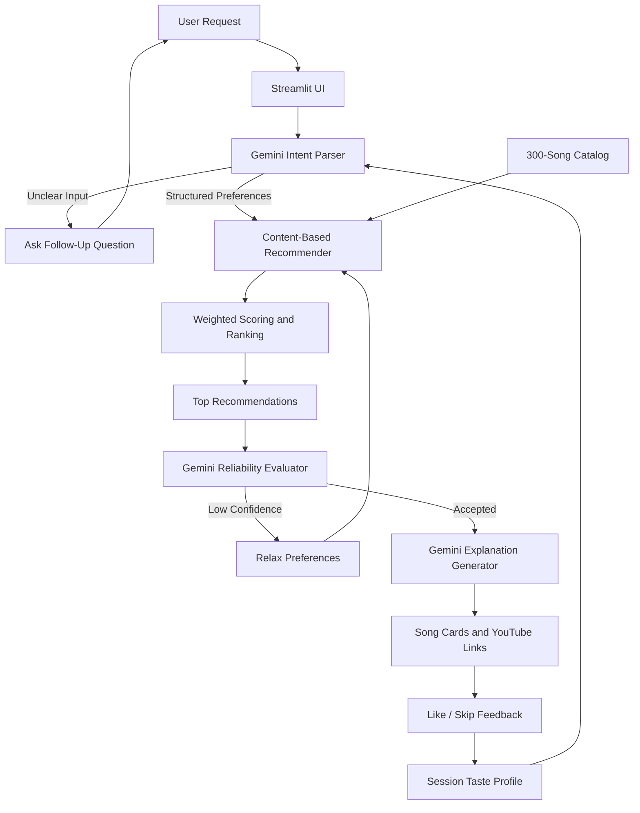

# VibeCheck — AI-Powered Music Recommender

**VibeCheck** is a hybrid AI music recommender. Describe how you want to feel — *"something dark and cinematic for a late-night drive"* — and VibeCheck turns that request into personalized song recommendations.

The system combines **Gemini 2.5 Flash** for natural-language understanding and recommendation evaluation with a deterministic **content-based scoring engine** operating over a curated catalog of **300 songs across 78 genres**.

Every recommendation includes a plain-language explanation and a direct YouTube link.

---

## Features

* Natural-language music requests
* Gemini-powered intent parsing
* Content-based song ranking
* 300-song curated catalog
* 78 supported genres
* Genre-family and mood-family matching
* Energy-based recommendation scoring
* Lyrical intensity and lyrical theme matching
* AI confidence and contradiction evaluation
* Low-confidence retry behavior
* Session-based taste profile
* Like / Skip feedback
* Replacement recommendations for skipped songs
* AI-generated recommendation explanations
* Direct YouTube links
* Structured logging
* Pytest testing
* Streamlit chat interface

---

## Tech Stack

* **Python**
* **Streamlit**
* **Gemini 2.5 Flash**
* **Google GenAI SDK**
* **Pytest**
* **python-dotenv**
* **CSV**

---

## System Architecture


```mermaid
flowchart TD
    A[User Request] --> B[Streamlit UI]
    B --> C[Gemini Intent Parser]

    C -->|Unclear Input| D[Ask Follow-Up Question]
    D --> A

    C -->|Structured Preferences| E[Content-Based Recommender]

    F[300-Song Catalog] --> E

    E --> G[Weighted Scoring and Ranking]
    G --> H[Top Recommendations]

    H --> I[Gemini Reliability Evaluator]

    I -->|Low Confidence| J[Relax Preferences]
    J --> E

    I -->|Accepted| K[Gemini Explanation Generator]

    K --> L[Song Cards and YouTube Links]

    L --> M[Like / Skip Feedback]
    M --> N[Session Taste Profile]
    N --> C
```

VibeCheck separates the parts of the system that benefit from AI reasoning from the parts that are more predictable and testable with deterministic logic.

---

## Recommendation Pipeline

### 1. Interpret the User Request

Users can describe what they want naturally:

```text
I need something relaxing while I study.
```

```text
Give me something aggressive for the gym.
```

```text
I want something calm but with intense lyrics.
```

Gemini converts the request into structured preferences such as:

```json
{
  "genre": "lofi",
  "mood": "focused",
  "energy": 0.38,
  "lyrical_intensity": null,
  "lyrical_theme": null,
  "needs_clarification": false
}
```

The parser can identify:

* Genre
* Mood
* Energy
* Lyrical intensity
* Lyrical theme

If the request is too vague to interpret, VibeCheck asks one short follow-up question.

---

### 2. Score the Song Catalog

Gemini does **not** directly choose the songs.

The structured preferences are passed to a deterministic Python recommendation engine that scores songs from the catalog.

### Scoring Weights

| Attribute         | Match       | Score |
| ----------------- | ----------- | ----: |
| Genre             | Exact       | +2.00 |
| Genre             | Same family | +1.00 |
| Mood              | Exact       | +1.50 |
| Mood              | Same family | +0.75 |
| Energy            | Within 0.10 | +1.00 |
| Energy            | Within 0.25 | +0.50 |
| Lyrical intensity | Within 0.15 | +0.75 |
| Lyrical intensity | Within 0.30 | +0.35 |
| Lyrical theme     | Exact       | +0.50 |

Songs are ranked from highest to lowest score.

---

## Genre and Mood Families

Exact matching alone can be too restrictive.

For example, a user requesting:

```text
pop
```

may still enjoy:

```text
indie pop
synth-pop
city pop
electropop
```

VibeCheck groups related genres into broader families so similar styles receive partial credit.

Examples include:

* Chill
* Upbeat
* Rock
* Urban
* Acoustic
* Electronic
* Jazz
* Cinematic

Mood matching works similarly.

For example:

```text
happy
fun
hopeful
nostalgic
```

belong to related positive moods, while:

```text
sad
melancholic
dark
reflective
emotional
```

share a darker emotional family.

---

## Song Catalog

VibeCheck uses a curated catalog of **300 songs across 78 genres**.

Each song contains attributes including:

```text
title
artist
genre
mood
energy
tempo
valence
danceability
acousticness
instrumentalness
lyrical intensity
lyrical theme
YouTube ID
```

Separating musical and lyrical properties allows the system to understand requests such as:

> *"Something peaceful but with emotionally heavy lyrics."*

without forcing everything into a single mood label.

---

## AI Reliability Evaluation

After the scoring engine produces its top recommendations, Gemini evaluates the result set.

The evaluator checks:

1. Do the songs fit what the user requested?
2. Are any preferences in conflict with the results?
3. Do the recommendations work together as a cohesive playlist?
4. How confident should the system be?

The result includes:

```text
High confidence
Medium confidence
Low confidence
```

along with a short verdict and any detected contradictions.

---

## Low-Confidence Recovery

VibeCheck does more than display a warning when the recommendation set looks weak.

If the evaluator returns **low confidence**, the system retries the recommendation process with relaxed constraints.

For example:

```text
Genre: lofi
Mood: chill
Energy: 0.90
```

contains a difficult combination because most lofi tracks in the catalog have much lower energy.

The pipeline can retry without the energy restriction:

```text
Genre: lofi
Mood: chill
```

and then evaluate the new results again.

```text
Recommendations
      ↓
AI Evaluation
      ↓
Low Confidence?
   ┌──────┴──────┐
  Yes            No
   ↓              ↓
Relax          Continue
Preferences
   ↓
Rerank
```

---

## AI-Generated Explanations

Once the final recommendation set is accepted, Gemini generates a conversational explanation for each song.

Instead of exposing raw scoring output such as:

```text
genre match (+2.0)
mood match (+1.5)
energy close match (+1.0)
```

the user receives a natural explanation of why the song fits their request.

The explanation generator also attempts to mirror the tone of the user's message.

---

## Session Personalization

VibeCheck maintains a lightweight taste profile during the current session.

It tracks:

* Recently requested genres
* Recently requested moods
* Average requested energy
* Number of recommendation requests

When a later request is vague, that context can help the intent parser understand what the user is likely looking for.

---

## Like / Skip Feedback

Each recommendation includes **Like** and **Skip** controls.

### Like

Liked songs contribute information about:

* Preferred genres
* Preferred moods
* Average energy

This information can influence later recommendations during the session.

### Skip

The recommender initially keeps additional ranked songs in reserve.

```text
Top 10 Ranked Songs
        ↓
Top 5 → Displayed
Next 5 → Reserve Pool
```

When a user skips a recommendation, VibeCheck replaces it with the next song from the reserve pool.

---

## Sample Interactions

### Example 1 — Strong Match: High-Energy Pop

User profile:

```text
Genre: pop
Mood: happy
Energy: 0.92
```

Example scoring output:

```text
#1 Happy — Pharrell Williams
Genre: pop | Mood: happy | Energy: 0.82
Score: 4.50
Why: genre match (+2.0); mood match (+1.5); energy close match (+1.0)

#2 Watermelon Sugar — Harry Styles
Genre: pop | Mood: happy | Energy: 0.80
Score: 4.00
Why: genre match (+2.0); mood match (+1.5); energy partial match (+0.5)

#3 Blinding Lights — The Weeknd
Genre: pop | Mood: fun | Energy: 0.90
Score: 3.75
Why: genre match (+2.0); similar mood (+0.75); energy close match (+1.0)
```

The highest-ranked result matches all three primary dimensions.

---

### Example 2 — Conflicting Preferences

User profile:

```text
Genre: lofi
Mood: chill
Energy: 0.90
```

Example results:

```text
#1 Aruarian Dance — Nujabes
Genre: lofi | Mood: chill | Energy: 0.38
Score: 3.50

#2 South of the River — Tom Misch ft. Loyle Carner
Genre: lofi | Mood: chill | Energy: 0.35
Score: 3.50
```

The deterministic scoring engine gives strong genre and mood points even though the songs are far from the requested energy.

This exposed a weakness in purely weighted recommendation systems and helped motivate the AI reliability layer.

---

### Example 3 — Jazz

User profile:

```text
Genre: jazz
Mood: relaxed
Energy: 0.37
```

Example results:

```text
#1 Come Away With Me — Norah Jones
Genre: jazz | Mood: relaxed | Energy: 0.38
Score: 4.50

#2 Take Five — Dave Brubeck Quartet
Genre: jazz | Mood: relaxed | Energy: 0.45
Score: 4.50

#3 Don't Know Why — Norah Jones
Genre: jazz | Mood: chill | Energy: 0.38
Score: 3.75
```

Expanding the catalog significantly improved niche-genre recommendations compared with the original prototype.

---

## Design Decisions

### Why Content-Based Filtering?

Collaborative filtering normally relies on behavior from many users.

VibeCheck does not have a large user-history dataset, so content-based filtering allows recommendations to work immediately using song attributes.

The trade-off is that the system is better at finding music similar to what the user describes than discovering preferences completely outside that description.

---

### Why Gemini?

Requests such as:

> *"Something relaxing but with intense lyrics."*

contain multiple dimensions.

A simple keyword matcher cannot easily distinguish between the sound of a song and the emotional weight of its lyrics.

Gemini is used to interpret this kind of natural-language nuance while the deterministic recommender remains responsible for selecting songs from the catalog.

---

### Why Not Let Gemini Recommend Songs Directly?

The song catalog remains the source of truth.

Letting the model freely invent recommendations could introduce:

* Songs outside the catalog
* Incorrect metadata
* Unpredictable ranking
* Hard-to-test behavior

Instead:

```text
Gemini → Understand intent

Python → Rank catalog songs

Gemini → Evaluate and explain
```

---

### Why Separate Lyrics From Mood?

A song can sound calm while carrying emotionally intense lyrics.

Using separate fields for:

```text
mood
lyrical intensity
lyrical theme
```

allows the system to distinguish those characteristics instead of treating them as the same thing.

---

### Why a Curated Catalog?

A very large external catalog can introduce inconsistent or noisy metadata.

The curated 300-song dataset is intentionally small enough to inspect and test while still covering a wide range of styles.

---

## Testing Summary

### What Worked

The scoring algorithm performed well for standard profiles such as:

* High-energy pop
* Chill lofi
* Intense rock
* Synthwave

Genre and mood families also allowed related styles to appear without requiring exact matches.

Expanding the catalog improved niche recommendations significantly.

---

### What Failed

One important failure involved conflicting preferences.

A request for:

```text
lofi + chill + energy 0.90
```

still ranked quiet lofi tracks highly because genre and mood contributed more points than energy.

Increasing the importance of energy did not solve the problem cleanly.

For example, giving energy too much weight caused songs with the wrong emotional tone to compete with much better stylistic matches simply because their numeric energy values were close.

The lesson was that recommendation quality cannot always be fixed by changing a single weight.

---

### Runtime Failures

Live testing also exposed external-service limitations:

* Gemini API quotas can interrupt recommendations.
* Retry logic cannot recover from a fully exhausted daily quota.
* Generic fallback messages can hide the difference between invalid input and an API failure.

These cases highlighted the importance of distinguishing user errors from infrastructure failures.

---

## What I Learned

A recommendation system can be mathematically correct and still feel wrong.

The hardest part of VibeCheck was not simply calling an AI model. It was deciding what the AI should control and what should remain deterministic.

The architecture that worked best was:

```text
AI understands the request
        ↓
Algorithm ranks candidates
        ↓
AI evaluates the result
        ↓
AI explains the recommendation
```

Data quality and scoring design were just as important as the model itself.

The goal became more than returning results — it became returning results that make sense to someone who never saw the scoring algorithm.

---

## Model Card

For documentation of the recommendation system's scoring logic, limitations, and responsible-AI considerations, see:

[`model_card.md`](./model_card.md)

---

## Project Structure

```text
Vibe_Check/
├── app.py
├── requirements.txt
├── model_card.md
├── reflection.md
│
├── assets/
│   └── Gemini Song Recommendation.png
│
├── data/
│   └── songs.csv
│
├── src/
│   ├── main.py
│   └── recommender.py
│
└── tests/
    └── test_recommender.py
```

---

## Running Locally

### 1. Clone the Repository

```bash
git clone https://github.com/Christian101GTZ/Vibe_Check.git
cd Vibe_Check
```

### 2. Create a Virtual Environment

**Windows**

```bash
python -m venv .venv
.venv\Scripts\activate
```

**macOS / Linux**

```bash
python -m venv .venv
source .venv/bin/activate
```

### 3. Install Dependencies

```bash
pip install -r requirements.txt
```

### 4. Configure Gemini

Create a `.env` file:

```env
GOOGLE_API_KEY=your-api-key-here
```

The `.env` file is excluded from Git through `.gitignore`.

### 5. Start VibeCheck

```bash
streamlit run app.py
```

### 6. Run Tests

```bash
pytest
```

---

## Project Evolution

VibeCheck began as a small rule-based command-line recommender using **24 songs** and manually entered preference values.

The current version expands that foundation with:

* 300 songs
* 78 genres
* Natural-language requests
* Gemini intent parsing
* Lyrical preference modeling
* Recommendation reliability evaluation
* Session personalization
* Like / Skip feedback
* Streamlit interface
* Logging
* Automated testing

The system evolved by identifying where the deterministic recommender performed well, where it failed, and adding AI only where natural-language reasoning provided a clear benefit.

---

## Demo

[Watch the VibeCheck walkthrough](https://www.loom.com/share/2f052a383c5542f3b063ecd4de78d4ca)
